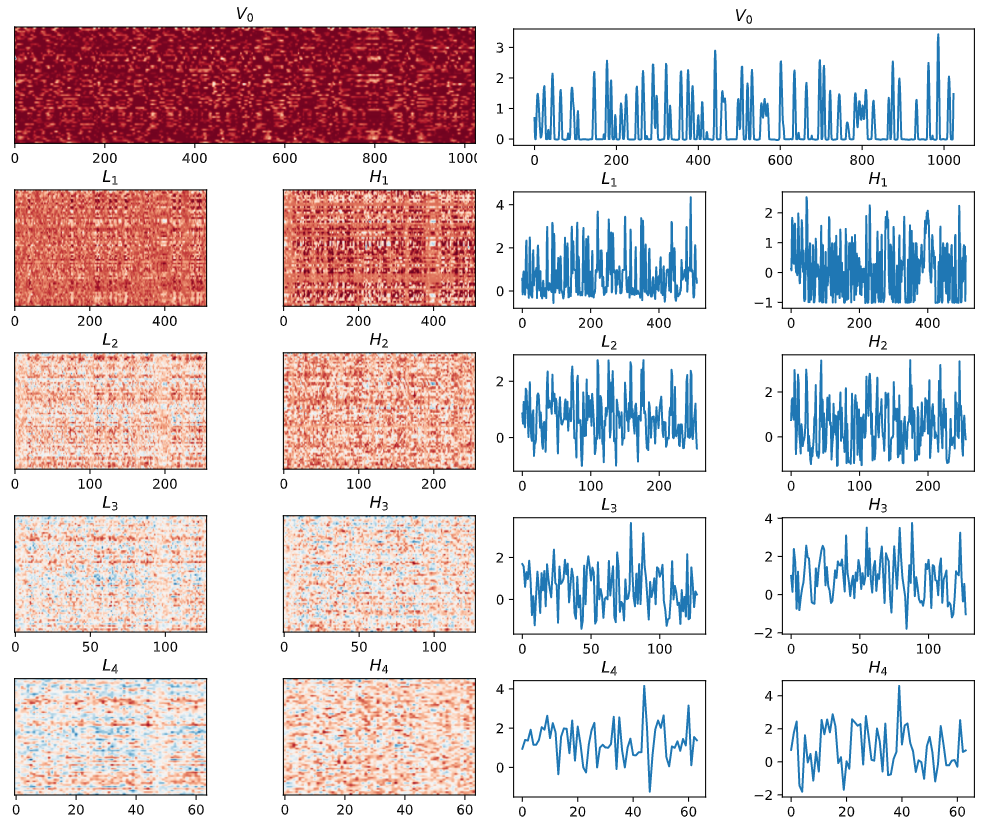

# AWN

**为响应[开放共享科研记录行动倡议(DCOX)](https://mmcheng.net/docx/)，本工作将提供中文文档，为华人学者科研提供便利。**

"自适应小波网络在自动调制分类中的应用研究"开源代码。

张嘉伟，王天天，[冯志玺](https://faculty.xidian.edu.cn/FZX/zh_CN/index.htm)，[杨淑媛](https://web.xidian.edu.cn/syyang/)

西安电子科技大学

[[论文](https://ieeexplore.ieee.org/document/10058977)] | [[中文文档](doc-CN/README.md)] | [[代码](https://github.com/zjwXDU/AWN)]


## 准备

### 数据准备

我们在RML2016.10a, RML2016.10b和RML2018.01a三个数据集上进行了实验：

| 数据集      | 类别                                                         | 样本数量         |
| ----------- | ------------------------------------------------------------ | ---------------- |
| RML2016.10a | 8种数字调制：8PSK, BPSK, CPFSK, GFSK, PAM4, 16QAM, 64QAM, QPSK；3种模拟调制：AM-DSB，AM-SSB，WBFM | 22万(2×128)      |
| RML2016.10b | 8种数字调制：8PSK, BPSK, CPFSK, GFSK, PAM4, 16QAM, 64QAM, QPSK；3种模拟调制：AM-DSB，WBFM | 120万(2×128)     |
| RML2018.01a | 19种数字调制：32PSK, 16APSK, 32QAM, GMSK, 32APSK, OQPSK, 8ASK, BPSK, 8PSK, 4ASK, 16PSK, 64APSK, 128QAM, 128APSK, 64QAM, QPSK, 256QAM, OOK, 16QAM；5种模拟调制：AM-DSB-WC, AM-SSB-WC, AM-SSB-SC, AM-DSB-SC, FM, | 255.59万(2×1024) |

数据集可以从[DeepSig](https://www.deepsig.ai/)网站下载。请将下载后得到的压缩包直接解压入`./data`目录，并保持文件名不变。最后的`./data`目录结构如下所示：

```
data
├── GOLD_XYZ_OSC.0001_1024.hdf5
├── RML2016.10a_dict.pkl
└── RML2016.10b.dat
```

### 预训练模型

我们提供了在三个数据集上的预训练模型，你可以从[Google Drive](https://drive.google.com/file/d/1vJnjuPFFbraEc__F8AXhbzFyWwooMWoL/view?usp=share_link)或者[百度网盘](https://pan.baidu.com/s/1GjITK7VL_PrIcbZ8zc3oSw?pwd=6znj)中下载。请将下载得到的压缩文件直接解压入`./checkpoint`中。

### 环境配置

- Python >= 3.6
- PyTorch >=1.7

这一版本的代码测试于Pytorch==1.8.1。

## 训练

运行以下命令来训练AWN。(`<DATASET>`属于{2016.10a, 2016.10b, 2018.01a})。

```
python main.py --mode train --dataset <DATASET>
```

三个数据集的YAML配置在`./config`中。

运行指令后，在`./training`目录下会建立一个新目录`<DATASET>_$`，在`./<DATASET>$`下会创建`./models, ./result, ./log`。训练好的模型会保存至`./models`，训练日志保存至`./log`，训练集，验证集的损失和准确率与学习率变化则一起绘制在`./result`。

当训练完成后，会自动进行一次在测试集上的测试，此处可以参见*评估*部分。

## 评估

运行以下命令来评估训练后的AWN。

```
python main.py --mode eval --dataset <DATASET>
```

运行指令后，与*训练*时一致，在`./inference`目录下会建立一个新目录`<DATASET>_$`。测试集上的*总体准确率*，*宏F1-score*，*Kappa系数*会显示在终端上。测试日志保存至`./log`，准确率随信噪比的变化曲线，混淆矩阵保存至`./result`。

如果您还有进一步分析的需要，我们建议修改`Run_Eval()`函数来直接保存原始数据，如*Confmat_Set*等。

## 可视化



我们提供了额外的一种模式来可视化自适应提升方案对特征图的分解，它可以被以下命令调用：

```
python main.py --mode visualize --dataset <DATASET>
```

与*评估*时类似，绘制的图像以`.svg`的形式储存在`./result`下。

## 致谢

部分代码借鉴了[DAWN](https://github.com/mxbastidasr/DAWN_WACV2020)，衷心感谢他们杰出的工作。

## 开源许可证

本代码许可证为[MIT LICENSE](https://github.com/zjwXDU/AWN/blob/main/LICENSE). 注意！我们的代码依赖于一些拥有各自许可证的第三方库和数据集，你需要遵守对应的许可证协议。

## 引文

如果您觉得我们的工作对您的研究有帮助，请考虑引用我们的论文：

```
@ARTICLE{10058977,
	author={Zhang, Jiawei and Wang, Tiantian and Feng, Zhixi and Yang, Shuyuan},
	journal={IEEE Transactions on Cognitive Communications and Networking}, 
	title={Towards the Automatic Modulation Classification with Adaptive Wavelet Network}, 
	year={2023},
	doi={10.1109/TCCN.2023.3252580}
}
```

联系方式：zjw AT stu DOT xidian DOT edu DOT cn